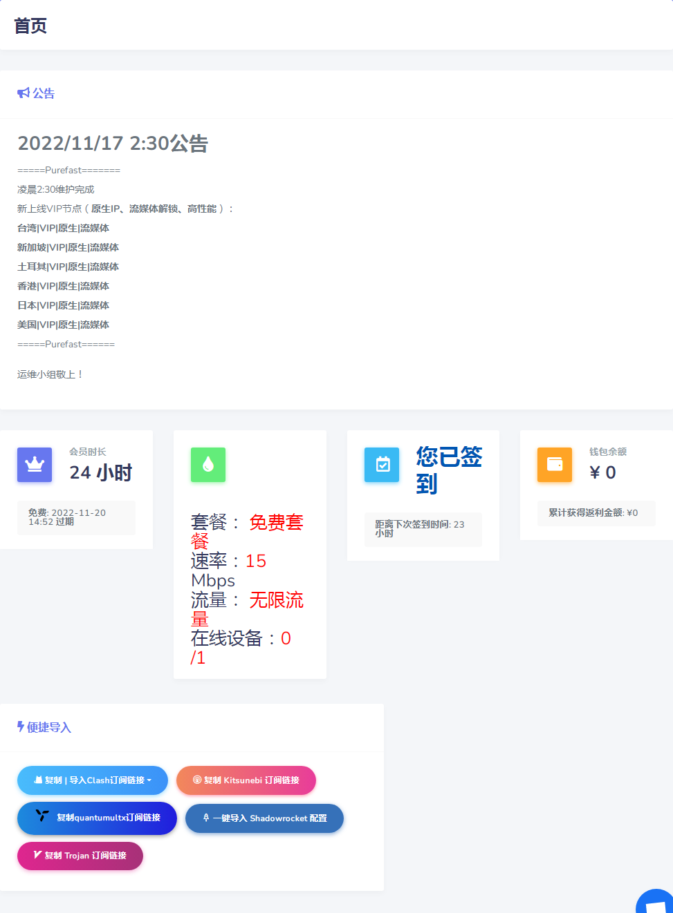

# PFvpn-checkin
用于PFvpn自动签到，适用于nonebot2

### 由于官网加了五秒盾，直接请求方式失效，故采用playwright进行签到

- 新增异步协程版，可进行多账号签到，如使用nonebot需修改`init.py`中发送图片名称，添加签到账号前三位，如将`result.png`修改为`result978.png`

------

<font size="30" color="lightblue">脚本可以使用，稳定性未知，代码很烂，能跑就行</font>

------

# 使用方式

首先安装playwright

```python
pip install playwright
python -m playwright install
```

修改**checkin.py** 中要进行签到的账号和密码

linux无图形界面需要将第七行代码`headless=False`改为`headless=True` 

- 非nonebot使用  

  直接使用checkin.py文件即可，自行设置定时任务

  github action 不会用 摆烂了 欢迎pr

- nonebot使用

  将**checkin.py**文件放在bot根目录，nonebot_plugin_PFvpn_checkin文件夹放置在src/plugins文件夹中，按注释修改**init.py**文件即可

  脚本会定时执行，也可手动进行签到，签到完成后会将页面截图发送给设定的QQ

  


